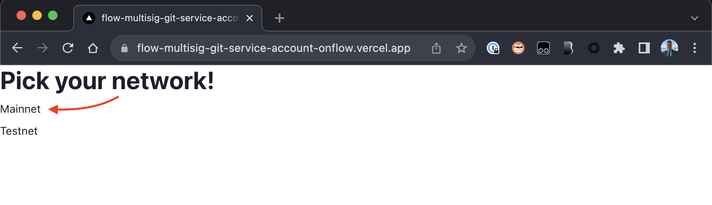
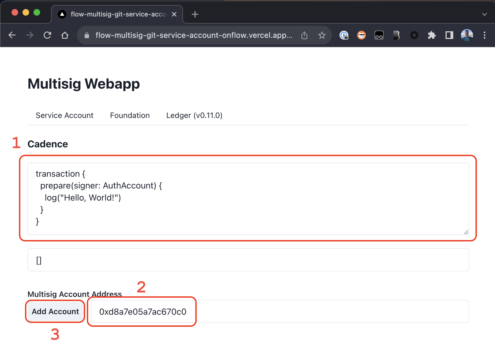
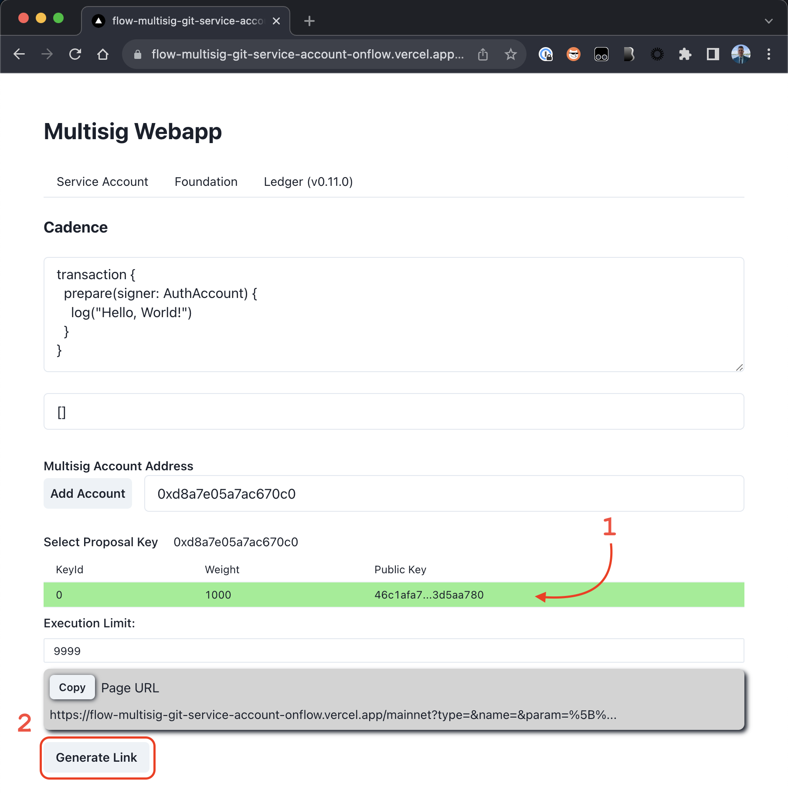
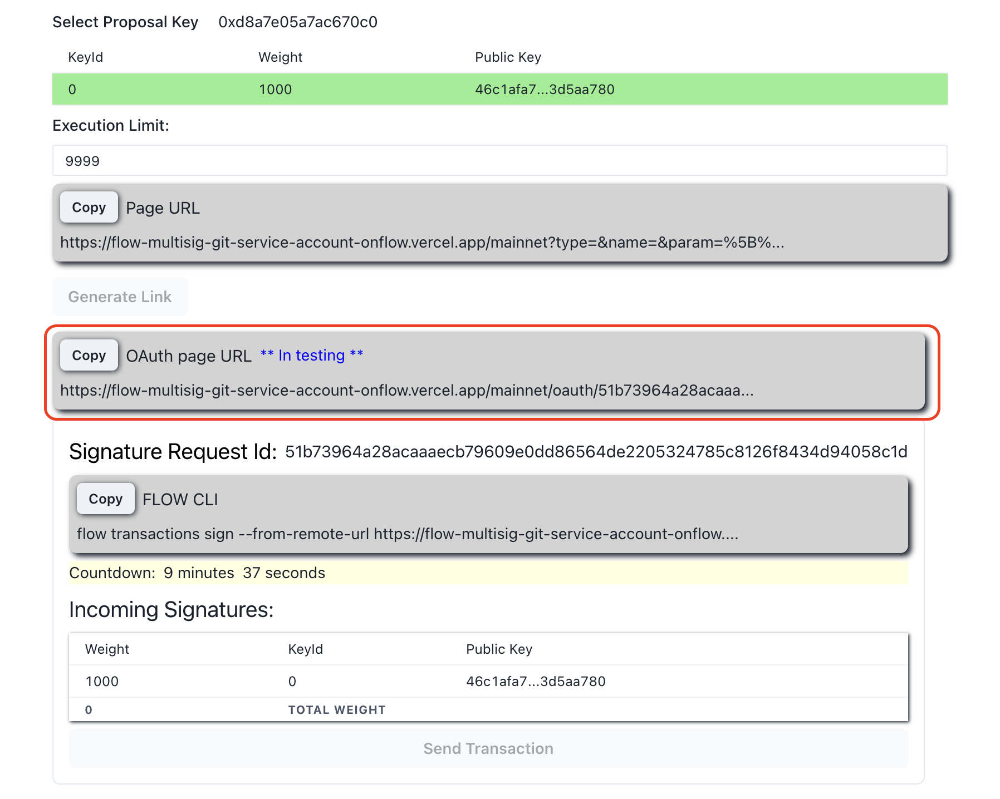
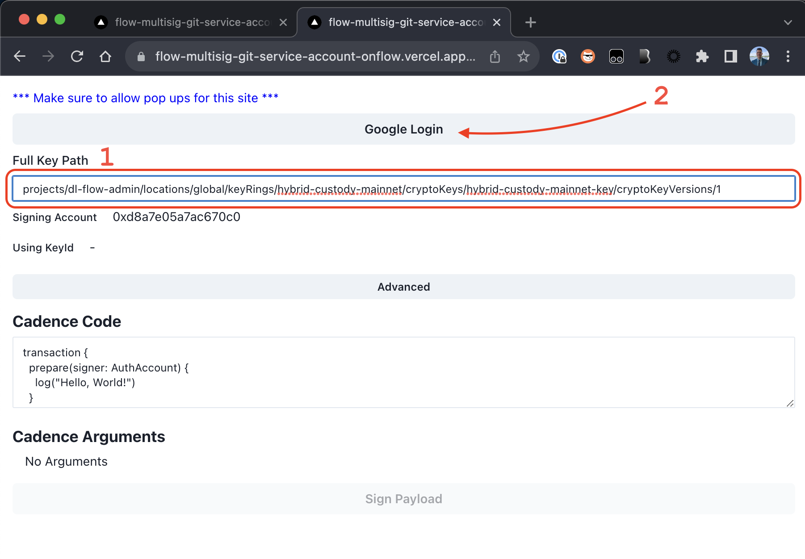
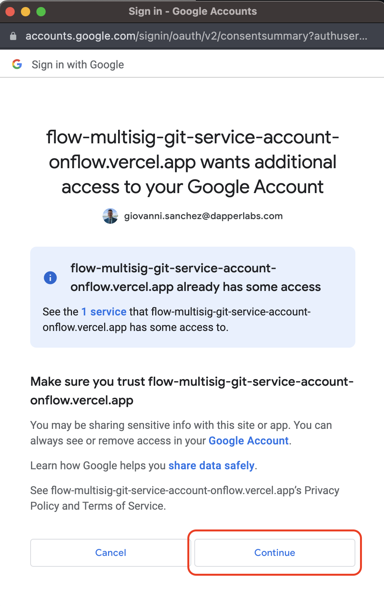
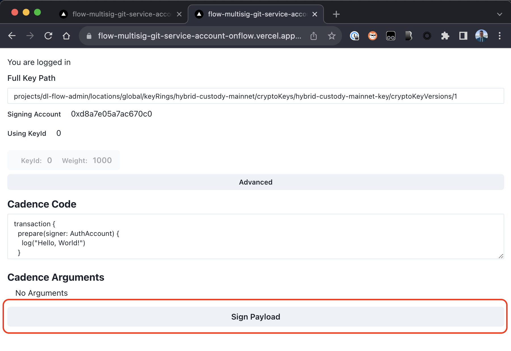
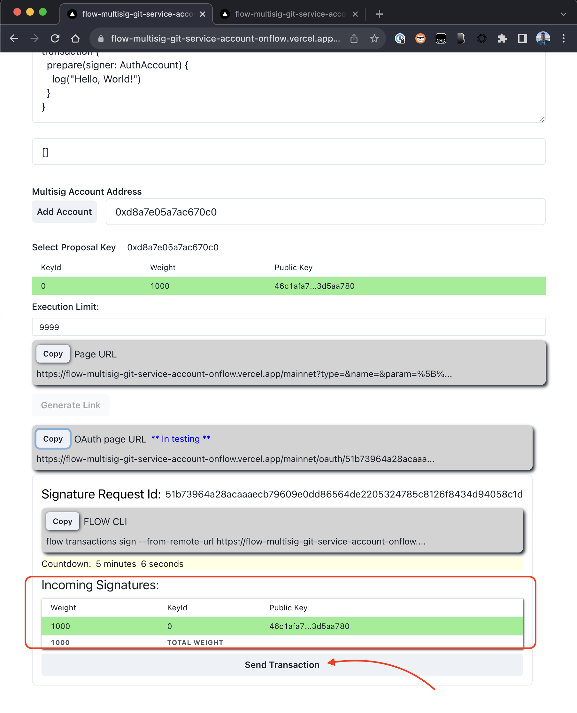

# [WIP] Hybrid Custody Account

> :warning: This repo is still a WIP while configuring multi-sig on the mainnet HybridCustody deployment account

## Requirements for signers
- Git
- Flow CLI
- Google Cloud SDK

### Git

We will be using this Git repository to coordinate, achieve consensus on transaction submission, and share signed transactions. So you will need to be able to clone the repo on your local machine.

If you do not have Git configured to authenticate with GitHub, [Github Desktop](https://desktop.github.com/) is likely the easiest way to get started

To ensure that it's properly installed, please `git pull` the main branch of this repository.

### Flow CLI

If you have homebrew:

```sh
brew install flow-cli
```

Otherwise, you'll have to follow the instructions [here](https://docs.onflow.org/flow-cli/install)

To ensure it's properlly installed, please run the following:

```sh
flow version
```

### Google Cloud SDK

If you have homebrew:

```sh
brew install --cask google-cloud-sdk
```

Otherwise, you'll have to follow the instructions [here](https://cloud.google.com/sdk/docs/install)

To ensure it's properlly installed, please run the following:

```sh
gcloud auth application-default login
```

This should pop up a tab in your browser asking you to authorize the SDK. If you're able to, then you're all set!

## Transaction Signing & Sending

To facilitate multi-sig transaction signing & sending, we'll use the tool created by [@bthaile](https://github.com/bthaile) found [here](https://flow-multisig-git-service-account-onflow.vercel.app/).

In the near future, the tool will pull template transactions from this repo. In the meantime, the transactions scripts can be pasted from this repo.

> :warning: When sending a transaction, signers should coordinate a time to meet virtually in a signing party. Signing ritual procedures to follow shortly.

### Walkthrough

#### Setup transaction

1. Select your network


1. Paste the script

    - Paste your script into the Cadence box
    - Enter the Address you want to send the transaction
    - Click "Add Account"

1. Generate transaction link

    - Select the key to sign the transaction
    - Generate the transaction link

#### Signing
1. Visit the generated link



1. Google Login

    - Enter the key path (AKA resource ID) found in your KMS console
    - Click "Google Login"

1. Click "Continue" in the resulting popup, authorizing the transaction signature 


1. Sign the transaction


#### Sending

Back at the setup page, we can see that the signature was received. When all signatures have been received, we can send the signed transaction payload.
